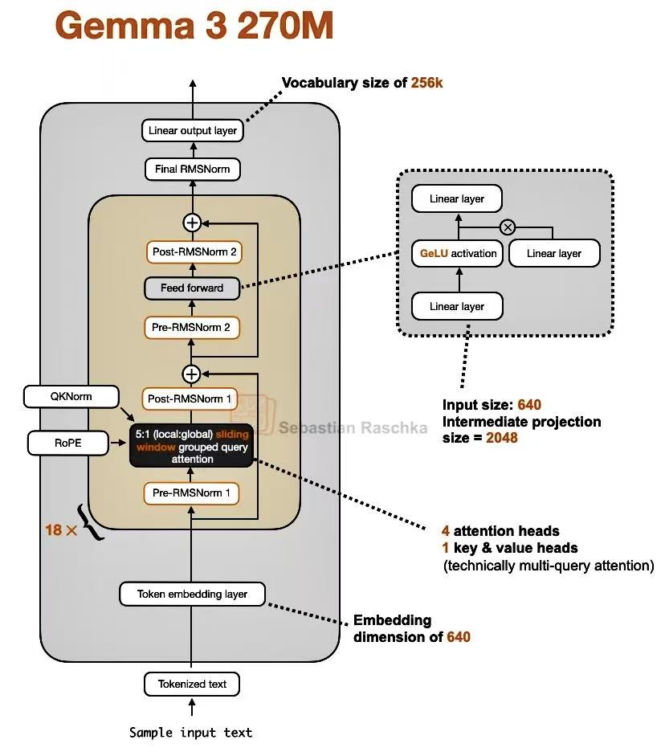
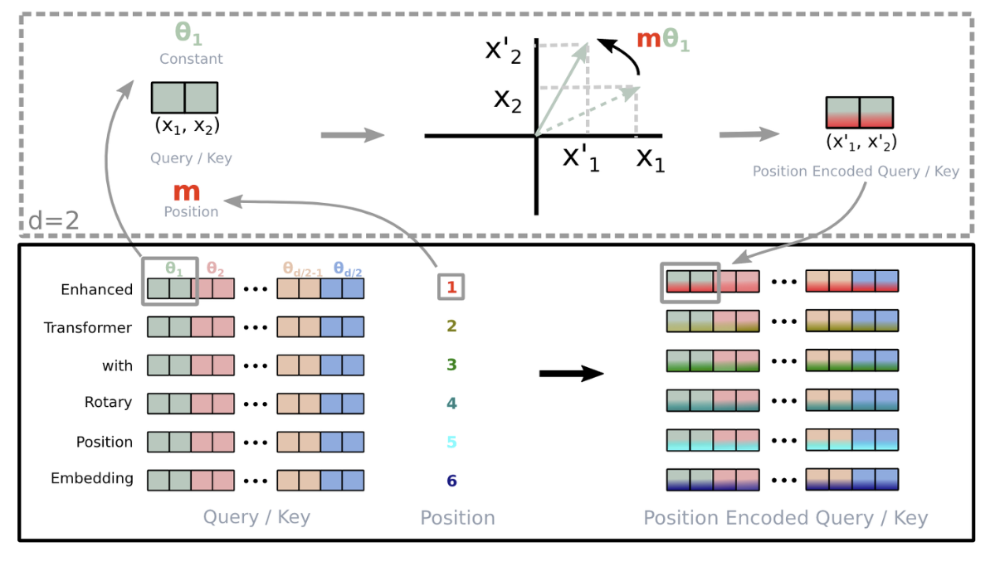
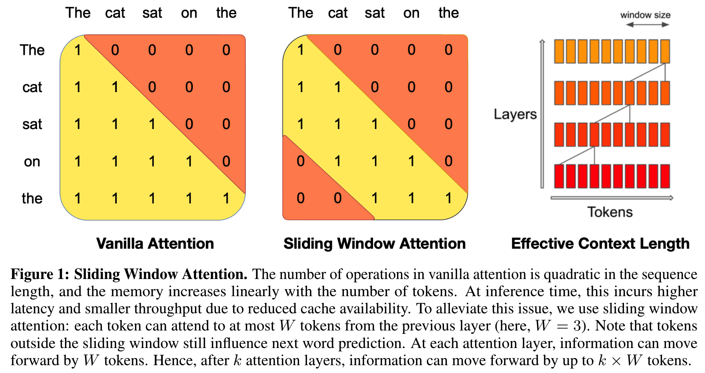

# Gemma3

Gemma3 是 Google 推出的轻量级、高性能开源模型，支持多种尺寸（1B、4B、12B 和 27B），专为单 GPU 或 TPU 设计。它基于 Transformer 架构，进行了多项重要改进。本指南将详细介绍如何从零开始实现 Gemma3 模型，包括其核心架构、关键创新点以及完整的实现代码。

Gemma3的模型结构如下图所示：


---

## 1. 构建 RMS 层

Gemma3 使用 **RMSNorm**（均方根标准化）。LayerNorm 需要计算均值和标准差，计算量较大，且涉及减法操作，可能影响数值稳定性。RMSNorm 省略了均值计算，仅使用 均方根（RMS, Root Mean Square） 归一化，其中：
$rms(x) = \sqrt{ \frac{1}{d} \sum_{i=1}^{d} x_i^2 }$  ，
$\hat{x} = \frac{x}{rms(x) + \epsilon}$  ，
$y = \gamma \hat{x}$。
与传统实现不同，Gemma3 将缩放因子从 γ 改为 1 + γ，其中 γ 初始化为 0。这种设计使得初始状态下的标准化操作更加稳定，有助于模型训练过程中的收敛性和数值稳定性。
``` python
class RMSNorm(nn.Module):
    def __init__(self, emb_dim, eps=1e-6, bias=False):
        super().__init__()
        self.eps = eps  # 小常数，防止除以零，增加数值稳定性
       
        # Gemma3使用零中心权重并在前向传播中使用(1 + weight)
        self.scale = nn.Parameter(torch.zeros(emb_dim))  # 缩放参数，初始化为0，实际使用(1+scale)
        
        self.shift = nn.Parameter(torch.zeros(emb_dim)) if bias else None  # 可选的偏置参数，如果bias为True则启用

    def forward(self, x):
        input_dtype = x.dtype  # 保存输入的数据类型，以便最后转换回去
        x_f = x.float()  # 转换为float类型进行计算，提高数值精度
        
        var = x_f.pow(2).mean(dim=-1, keepdim=True)  # 计算均方值（不是方差，因为没有减去均值）
        x_norm = x_f * torch.rsqrt(var + self.eps)  # 归一化：x / sqrt(mean(x^2) + eps)
        
        out = x_norm * (1.0 + self.scale.float())  # 应用缩放：(1 + scale) * 归一化结果，scale初始为0
        
        if self.shift is not None:
            out = out + self.shift.float()  
        
        return out.to(input_dtype) 
```        

## 2. FeedForward 层

Gemma 使用 **GeGLU**，即一种门控线性单元变体。公式为：

`output = FC3( GELU( FC1(x) ) ⊙ FC2(x) )`

（其中 `⊙` 是逐元素乘法）。

输入 `x` 同时通过两个不同的线性层 (`fc1` 和 `fc2`)。fc1 的输出经过 **GELU** 激活函数，产生一个"内容"或"值"。`fc2` 的输出作为一个"门"，控制哪些信息可以通过。两者进行**逐元素相乘**，实现精细的信息流控制。门控后的结果通过 `fc3` 投影回原始嵌入维度。

GELU 激活函数公式为：

`GELU(x) = x ⋅ Φ(x) = 0.5x[1+erf(x/√2)]`

其中：Φ(x) 为标准正态分布的累积分布函数（CDF），`erf` 为误差函数（error function），`x` 为输入值。

由于 GELU 的精确计算（涉及误差函数 `erf`）在计算上相对昂贵，一般使用高度精确的近似公式，该公式使用双曲正切函数 `tanh`。

`GELU(x) ≈ 0.5x(1+tanh(√(2/π)(x+0.044715x^3)))`

```python
class FeedForward(nn.Module):
    """GeGLU结构的门控前馈网络 (Gated Feed-Forward Network)"""
    def __init__(self, cfg):
        super().__init__()
        # 第一个线性层：用于生成"内容"或"值"
        self.fc1 = nn.Linear(cfg["emb_dim"], cfg["hidden_dim"], dtype=cfg["dtype"], bias=False)
        # 第二个线性层：用于生成"门"控信号
        self.fc2 = nn.Linear(cfg["emb_dim"], cfg["hidden_dim"], dtype=cfg["dtype"], bias=False)
        # 第三个线性层：将处理后的特征投影回原始维度
        self.fc3 = nn.Linear(cfg["hidden_dim"], cfg["emb_dim"], dtype=cfg["dtype"], bias=False)

    def forward(self, x):
        # 门控机制的核心是使用两个并行路径，其中一个路径提供"内容"，另一个路径提供"门"
        
        # 路径1：生成内容（将被GELU激活）
        x_fc1 = self.fc1(x)
        # 路径2：生成门控信号（直接作为权重）
        x_fc2 = self.fc2(x)
        
        x = nn.functional.gelu(x_fc1, approximate="tanh") * x_fc2
        
        # 将门控后的结果投影回原始嵌入维度
        return self.fc3(x)
 ```
GELU可以理解为：根据输入值的大小，以一定的概率来决定让多少信息通过。
对于大的正输入：`tanh(...) ≈ 1`，因此 `GELU(x) ≈ 0.5x(1+1) = x`。信息几乎完全通过。
       对于大的负输入：`tanh(...) ≈ -1`，因此 `GELU(x) ≈ 0.5x(1-1) = 0`。信息几乎被完全抑制。
        对于接近零的输入：`tanh(...) ≈ 0`，因此 `GELU(x) ≈ 0.5x(1 + 0) = 0.5x`。信息部分通过。

这种设计不仅增强了网络的表达能力，还能够选择性地控制信息流动，提高模型在处理复杂语言模式时的效率和准确性。

## 3. Attention 计算

### 3.1 旋转位置编码（RoPE）

为了确保模型能够处理超长上下文并保持顺序信息，Gemma3 对全局注意力层中的旋转位置编码（RoPE）进行了优化。具体来说，RoPE   的基频从原本的 10k 增加到 1M。这一调整扩展了位置编码的有效周期，使得模型在处理如 128K    长度的序列时，依然能够精确捕捉到相对位置关系。与此同时，局部注意层保持较低的 RoPE 频率（10k    基频），从而更专注于处理局部区域的精细关系。

```python
def precompute_pos_cis(dim: int, end: int = int(32 * 1024), theta: float = 1e6):
    """
    计算旋转位置编码的复数旋转向量（cis向量）
    Args:
        dim: 特征维度
        end: 最大序列长度
        theta: 旋转角度的基数，控制波长分布
    Returns:
        pos_cis: 复数张量，形状为 [end, dim//2]，包含所有位置的角度信息
    """
    # 计算频率向量
    freqs = 1.0 / (theta ** (torch.arange(0, dim, 2)[: (dim // 2)].float() / dim))
    
    # 生成位置序列 [0, 1, 2, ..., end-1]
    t = torch.arange(end, device=freqs.device)  
    
    # 每个位置t乘以每个频率f，形状为[end, dim//2]
    freqs = torch.outer(t, freqs).float() 
    
    # 将角度转换为复数形式：cis(θ) = cos(θ) + i*sin(θ) = e^(iθ)
    pos_cis = torch.polar(torch.ones_like(freqs), freqs) 
    return pos_cis


def apply_rotary_emb(x, pos_cis):
    """
    应用旋转位置编码到输入张量
    Args:
        x: 输入张量，形状为 [batch, seq_len, num_heads, dim]
        pos_cis: 预计算的旋转复数向量，形状为 [max_seq_len, dim//2]
    Returns:
        x_rotated: 应用旋转编码后的张量，形状与输入相同
    """
    def unite_shape(pos_cis, x):
        """调整pos_cis的形状以匹配x进行广播"""
        ndim = x.ndim
        assert 0 <= 1 < ndim
        assert pos_cis.shape == (x.shape[1], x.shape[-1])  # 检查形状匹配：x形状为(batch_size, seq_len, num_heads, dim)
        
        # 创建广播形状：[1, seq_len, 1, dim] 以便与x [batch_size, seq_len, num_heads, dim] 相乘
        shape = [d if i == 1 or i == ndim - 1 else 1 for i, d in enumerate(x.shape)]
        return pos_cis.view(*shape)
    original_dtype = x.dtype

    # 将输入的最后两维重塑为复数形式：[batch, seq_len, num_heads, dim] -> [batch, seq_len, num_heads, dim//2, 2] -> 复数
    x = torch.view_as_complex(x.float().reshape(*x.shape[:-1], -1, 2))
    
    # 调整旋转向量的形状以便广播
    pos_cis = unite_shape(pos_cis, x)
    
    #复数乘法实现旋转 (a+bi) * (cosθ + i*sinθ) = 旋转后的向量
    x_rotated = torch.view_as_real(x * pos_cis).flatten(3)
    return x_rotated.to(dtype=original_dtype)
```

### 3.2 分组查询注意力（Grouped Query Attention）

Gemma3 引入了 **分组查询注意力** 机制，即将查询头进行分组处理，每组内的查询头共享相同的键值对。这样处理能够有效地减少键值缓存的内存占用，并且在保持模型性能的同时显著提升计算效率。
```python
class GroupedQueryAttention(nn.Module):
    def __init__(
        self, d_in, num_heads, num_kv_groups, head_dim=None, qk_norm=False,
        query_pre_attn_scalar=None, dtype=None,
    ):
        super().__init__()
        assert num_heads % num_kv_groups == 0, "头数必须被kv组数整除"

        self.num_heads = num_heads          # 查询头的总数
        self.num_kv_groups = num_kv_groups  # 键值头的分组数
        self.group_size = num_heads // num_kv_groups  # 每组共享的查询头数量

        if head_dim is None:
            assert d_in % num_heads == 0, "输入维度必须被头数整除"
            head_dim = d_in // num_heads

        self.head_dim = head_dim    # 每个头的维度
        self.d_out = num_heads * head_dim  # 输出维度

        self.W_query = nn.Linear(d_in, self.d_out, bias=False, dtype=dtype)  
        self.W_key = nn.Linear(d_in, num_kv_groups * head_dim, bias=False, dtype=dtype)   
        self.W_value = nn.Linear(d_in, num_kv_groups * head_dim, bias=False, dtype=dtype) 

        self.out_proj = nn.Linear(self.d_out, d_in, bias=False, dtype=dtype)  

        if qk_norm:
            self.q_norm = RMSNorm(head_dim, eps=1e-6) 
            self.k_norm = RMSNorm(head_dim, eps=1e-6) 
        else:
            self.q_norm = self.k_norm = None

        if query_pre_attn_scalar is not None:
            self.scaling = (query_pre_attn_scalar) ** -0.5  
        else:
            self.scaling = (head_dim) ** -0.5 

    def _prepare_grouped_kv(self, keys, values):
        """
        将KV头扩展到与查询头相同的数量
        keys: (batch_size, seq_len, num_kv_groups, head_dim)  
        values: (batch_size, seq_len, num_kv_groups, head_dim)  
        返回: 扩展后的keys和values, shape: (batch_size, num_heads, seq_len, head_dim)
        """
        # 先转置为 [batch_size, num_kv_groups, seq_len, head_dim]
        keys = keys.transpose(1, 2)
        values = values.transpose(1, 2)
        
        # 使用repeat_interleave将每个KV头重复group_size次
        expanded_keys = keys.repeat_interleave(self.group_size, dim=1)
        expanded_values = values.repeat_interleave(self.group_size, dim=1)
        return expanded_keys, expanded_values
    


    def _compute_attention(self, queries, keys, values, mask):
        """
        计算注意力机制,输入shape：(batch_size, num_heads, seq_len, head_dim)
        返回注意力上下文向量, shape: (batch_size, num_heads, seq_len, head_dim)
        """
        queries = queries * self.scaling
        
        # 计算注意力分数: Q @ K^T
        attn_scores = queries @ keys.transpose(2, 3)
        
        # 应用掩码（将掩码位置设置为负无穷）
        attn_scores = attn_scores.masked_fill(mask, -torch.inf)
        
        # 计算注意力权重（softmax归一化）
        attn_weights = torch.softmax(attn_scores, dim=-1)
        
        # 应用注意力权重到值上: 注意力权重 @ V
        context = attn_weights @ values
        return context
    
    def forward(self, x, mask, pos_cis):
        b, num_tokens, _ = x.shape
    
        queries = self.W_query(x)  # (batch_size,  seq_len, num_heads * head_dim)
        keys = self.W_key(x)       # (batch_size,  seq_len, num_kv_groups * head_dim)
        values = self.W_value(x)   # (batch_size,  seq_len, num_kv_groups * head_dim)
    
        queries = queries.view(b, num_tokens, self.num_heads, self.head_dim) 
        keys = keys.view(b, num_tokens, self.num_kv_groups, self.head_dim) 
        values = values.view(b, num_tokens, self.num_kv_groups, self.head_dim) 
    
        if self.q_norm:
            queries = self.q_norm(queries)
        if self.k_norm:
            keys = self.k_norm(keys)
            
        current_pos_cis = pos_cis[:num_tokens]
        queries = apply_rotary_emb(queries, current_pos_cis)
        keys = apply_rotary_emb(keys, current_pos_cis)
        # 应用旋转位置编码（RoPE）- 输入形状为 [batch_size, seq_len, num_heads, dim]
    
        # 扩展K和V以匹配查询头数量
        keys, values = self._prepare_grouped_kv(keys, values)  # (batch_size, num_heads, seq_len, head_dim)
        queries = queries.transpose(1, 2)
        context = self._compute_attention(queries, keys, values, mask)  # (batch_size, num_heads, seq_len, head_dim)
    
        context = context.transpose(1, 2).reshape(b, num_tokens, self.d_out)  # (batch_size, seq_len, d_out)
        return self.out_proj(context)
```
### 3.3 滑动窗口自注意力（Sliding Window Self-Attention）

为了支持长上下文处理，Gemma3 采用了 **局部-全局注意力层交替** 的混合架构：每 5 个局部层之间插入一个全局层，局部层采用，专门处理局部依赖关系，仅关注固定跨度（如 1024 个 token）范围内的上下文。全局层关注整个上下文范围，捕捉长距离语义依赖。

如图所示，左边是正常的causal attention，每个位置能看到自己和前面的位置，attention mask是个下三角矩阵。
右边则是滑动窗口自注意力的attention mask，这里的窗口大小为3。包括自己在内，每个位置只能往前看3个输入。
mask代码实现如下：
``` python
ones = torch.ones((seq_len, seq_len), dtype=torch.bool, device=device)#创建形状为(seq_len, seq_len)的全True矩阵

mask_global = torch.triu(ones, diagonal=1)       
# 防止看到未来的信息（标准因果掩码）,即对于位置i，只能看到位置j ≤ i的信息（不能看到j > i的未来信息）
#     j:  0 1 2 3 4 5 6 7
#  i
#     0:  0 1 1 1 1 1 1 1
#     1:  0 0 1 1 1 1 1 1
#     2:  0 0 0 1 1 1 1 1
#     3:  0 0 0 0 1 1 1 1
#     4:  0 0 0 0 0 1 1 1
#     5:  0 0 0 0 0 0 1 1
#     6:  0 0 0 0 0 0 0 1
#     7:  0 0 0 0 0 0 0 0

far_past = torch.triu(ones, diagonal=self.cfg["sliding_window"]).T
# 防止看到太遥远的过去信息（滑动窗口限制）,即对于位置i，不能看到位置j ≤ i - sliding_window的太遥远信息
# 当 sliding_window = 4 时
#     j:  0 1 2 3 4 5 6 7
#  i
#     0:  0 0 0 0 0 0 0 0
#     1:  0 0 0 0 0 0 0 0
#     2:  0 0 0 0 0 0 0 0
#     3:  0 0 0 0 0 0 0 0
#     4:  1 0 0 0 0 0 0 0
#     5:  1 1 0 0 0 0 0 0
#     6:  1 1 1 0 0 0 0 0
#     7:  1 1 1 1 0 0 0 0

mask_local = mask_global | far_past
# 每个位置只能看到有限的上下文窗口
# 当 sliding_window = 4 时, 滑动窗口掩码状态为
#     j:  0 1 2 3 4 5 6 7
# i
# 0:      0 1 1 1 1 1 1 1
# 1:      0 0 1 1 1 1 1 1
# 2:      0 0 0 1 1 1 1 1
# 3:      0 0 0 0 1 1 1 1
# 4:      1 0 0 0 0 1 1 1
# 5:      1 1 0 0 0 0 1 1
# 6:      1 1 1 0 0 0 0 1
# 7:      1 1 1 1 0 0 0 0
  ```
通过合理配置局部层和全局层的比例，这种混合架构实现了计算成本与性能的最佳平衡：在不显著增加计算成本的前提下，有效扩展上下文处理长度，将 KV 缓存内存开销从约 60% 大幅降低至不足 15%（基于 32K 上下文的测算结果）。


## 4. 组装 Gemma3 模型

通过整合以上所有核心组件和创新技术，Gemma3 构建了一个高效、强大的语言模型架构。这种设计不仅保证了模型的高性能表现，还有效控制了计算资源消耗，使其特别适合在资源受限的环境中部署和应用。
```python
class TransformerBlock(nn.Module):

    def __init__(self, cfg, attn_type):
        super().__init__()
        self.attn_type = attn_type 

        self.att = GroupedQueryAttention(
            d_in=cfg["emb_dim"],
            num_heads=cfg["n_heads"],
            num_kv_groups=cfg["n_kv_groups"],
            head_dim=cfg["head_dim"],
            qk_norm=cfg["qk_norm"],
            query_pre_attn_scalar=cfg["query_pre_attn_scalar"],
            dtype=cfg["dtype"],
        )
        self.ff = FeedForward(cfg)
        self.input_layernorm = RMSNorm(cfg["emb_dim"], eps=1e-6)
        self.post_attention_layernorm = RMSNorm(cfg["emb_dim"], eps=1e-6)
        self.pre_feedforward_layernorm = RMSNorm(cfg["emb_dim"], eps=1e-6)
        self.post_feedforward_layernorm = RMSNorm(cfg["emb_dim"], eps=1e-6)

    def forward(
        self,
        x,
        mask_global,
        mask_local,
        pos_cis_global,  
        pos_cis_local,  
    ):
        # 残差连接：保存输入用于后续相加
        shortcut = x
        x = self.input_layernorm(x)
        # 根据注意力类型选择不同的掩码和位置编码
        if self.attn_type == "sliding_attention":
            attn_mask = mask_local
            pos_cis = pos_cis_local  
        else:
            attn_mask = mask_global
            pos_cis = pos_cis_global  
        # 计算自注意力
        x_attn = self.att(x, attn_mask, pos_cis)
        x_attn = self.post_attention_layernorm(x_attn)
        # 残差连接：原始输入 + 注意力输出
        x = shortcut + x_attn

        # 再次使用残差连接
        shortcut = x
        # 前馈网络前的归一化
        x_ffn = self.pre_feedforward_layernorm(x)
        # 通过前馈网络（两个线性层+激活函数）
        x_ffn = self.ff(x_ffn)
         # 前馈网络输出归一化
        x_ffn = self.post_feedforward_layernorm(x_ffn)
        # 残差连接：注意力输出 + 前馈网络输出
        x = shortcut + x_ffn
        return x

class Gemma3Model(nn.Module):
    
    def __init__(self, cfg):
        super().__init__()
        # 确保每层都有指定的注意力类型
        assert cfg["layer_types"] is not None and len(cfg["layer_types"]) == cfg["n_layers"]
        
        # 词嵌入层：将token索引转换为向量
        self.tok_emb = nn.Embedding(cfg["vocab_size"], cfg["emb_dim"], dtype=cfg["dtype"])
        
        # Transformer块堆叠：构建深层网络
        self.blocks = nn.ModuleList([
            TransformerBlock(cfg, attn_type) for attn_type in cfg["layer_types"]
        ])
        
        # 最终归一化层和输出头
        self.final_norm = RMSNorm(cfg["emb_dim"], eps=1e-6)
        self.out_head = nn.Linear(cfg["emb_dim"], cfg["vocab_size"], bias=False, dtype=cfg["dtype"])
        
        self.cfg = cfg  # 保存配置

        # 局部位置编码（用于滑动窗口注意力）
        pos_cis_local = precompute_pos_cis(
            dim=cfg["head_dim"],           # 每个头的维度
            end=cfg["context_length"],     # 最大上下文长度
            theta=cfg["rope_local_base"],  # RoPE的theta参数（局部）
        )
        
        # 全局位置编码（用于全局注意力）
        pos_cis_global = precompute_pos_cis(
            dim=cfg["head_dim"],
            end=cfg["context_length"],
            theta=cfg["rope_base"],        # RoPE的theta参数（全局）
        )
        
        # 注册为buffer（不参与训练但需要保存的参数）
        self.register_buffer("pos_cis_local", pos_cis_local, persistent=False)
        self.register_buffer("pos_cis_global", pos_cis_global, persistent=False)

    
    def _create_masks(self, seq_len, device):
        """创建注意力掩码"""
        # 创建全True的方阵作为掩码基础
        ones = torch.ones((seq_len, seq_len), dtype=torch.bool, device=device)
        
        # 全局掩码：防止看到未来信息（因果掩码）
        mask_global = torch.triu(ones, diagonal=1)
        
        # 过远过去掩码：防止看到太遥远的过去信息
        far_past = torch.triu(ones, diagonal=self.cfg["sliding_window"]).T
        
        # 局部掩码：结合因果掩码和滑动窗口限制
        mask_local = mask_global | far_past
        
        return mask_global, mask_local
    

    def forward(self, input_ids):
        """前向传播"""
        # 获取输入形状 [batch_size, seq_len]
        b, seq_len = input_ids.shape
        
        # 词嵌入：将token索引转换为向量 [batch_size, seq_len] -> [batch_size, seq_len, emb_dim]
        x = self.tok_emb(input_ids) * (self.cfg["emb_dim"] ** 0.5)  # 缩放嵌入
        
        # 创建注意力掩码
        mask_global, mask_local = self._create_masks(seq_len, x.device)

        # 通过所有Transformer层
        for block in self.blocks:
            x = block(
                x,
                mask_global=mask_global,
                mask_local=mask_local,
                pos_cis_global=self.pos_cis_global,
                pos_cis_local=self.pos_cis_local,
            )

        # 最终归一化
        x = self.final_norm(x)
        
        #输出投影：转换为词汇表概率分布 [batch_size, seq_len, emb_dim] -> [batch_size, seq_len, vocab_size]
        logits = self.out_head(x.to(self.cfg["dtype"]))
        
        return logits
 ```
 
我们可以用以下代码进行模型的简单计算
``` python
#定义模型配置（270M参数版本）
GEMMA3_CONFIG_270M = {
    "vocab_size": 262_144,
    "context_length": 32_768,
    "emb_dim": 640,
    "n_heads": 4,
    "n_layers": 18,
    "hidden_dim": 2048,
    "head_dim": 256,
    "qk_norm": True,
    "n_kv_groups": 1,
    "rope_local_base": 10_000.0,
    "rope_base": 1_000_000.0,
    "sliding_window": 512,
    "layer_types": [
        "sliding_attention",
        "sliding_attention",
        "sliding_attention",
        "sliding_attention",
        "sliding_attention",
        "full_attention",
        "sliding_attention",
        "sliding_attention",
        "sliding_attention",
        "sliding_attention",
        "sliding_attention",
        "full_attention",
        "sliding_attention",
        "sliding_attention",
        "sliding_attention",
        "sliding_attention",
        "sliding_attention",
        "full_attention"
    ],
    "dtype": torch.bfloat16,
    "query_pre_attn_scalar": 256,
}
torch.manual_seed(123)
model = Gemma3Model(GEMMA3_CONFIG_270M)
print(model(torch.tensor([1, 2, 3, 4]).unsqueeze(0)))
print(model(torch.tensor([1, 2, 3, 4]).unsqueeze(0)).shape)
```
结果为：
```python
tensor([[[ 0.7500,  0.1060,  0.4844,  ...,  0.9414,  0.3984, -0.2324],
         [-0.3691, -0.1001,  0.8984,  ..., -0.2812,  0.4785,  0.8125],
         [-0.2285, -0.2578,  0.4082,  ...,  0.8008, -0.8672,  1.0625],
         [ 0.7109,  0.9336, -0.7852,  ..., -0.9844, -1.2500,  0.0649]]],
       dtype=torch.bfloat16, grad_fn=<UnsafeViewBackward0>)
torch.Size([1, 4, 262144])
```
模型参数总量为词嵌入层，Transformer层，输出层参数量相加。可以使用以下代码查看model中参数总数：
``` python
print(f"参数量: {sum(p.numel() for p in model.parameters()):,}")
```
结果为
``` python
参数量: 435,870,336
```
对于词嵌入层：
```
262,144 (词汇表) × 640 (嵌入维度) = 167,772,160 参数
```
本文设置模型有18个Transformer层，每层参数量由attention计算，前馈网络层和layernorm层所需参数组成。对于transformer层：
```markdown
q投影: 640 × 1024 = 655,360  
k投影:   640 × 256  = 163,840  ← MQA模式节省参数
v投影:   640 × 256  = 163,840
out投影: 1024 × 640 = 655,360
归一化:   256 × 2    = 512
每层attention: 1,639,912 参数
```
```markdown
第一层: 640 × 2048 = 1,310,720
第二层: 640 × 2048 = 1,310,720  
第三层: 2048 × 640 = 1,310,720
每层FFN: 3,932,160 参数
```
```markdown
4 × RMSNorm(640) = 2,560 参数
```
单层Transformer总计参数量为1,639,912+3,932,160+2560= 5,574,632。
18个Transformer层共有5,574,632 × 18 = 100,343,376 参数

 对于输出层：
```
640 × 262,144 = 167,772,160 参数
```
最终模型参数量为167,772,160+100,343,376  +167,772,160
= 435,870,336

可以注意到Gemma3用了Multi-Query Attention (MQA)，该方法能够减少大模型参数量，在基本保持性能的前提下提高推理速度。
```markdown
传统MHA: 4个独立KV头 → 640 × 1024 × 2 = 1,310,720 参数
MQA模式: 1个共享KV头 → 640 × 256 × 2  = 327,680 参数
每层节省:                983,040 参数
18层总节省:            17,694,720 参数
```
可用以下代码查看模型每层参数：
```python
for name, param in model.named_parameters():
    print(f"Name: {name}")
    print(f"Shape: {param.shape}")
    print(f"Values: {param}")
    print("---")
```

